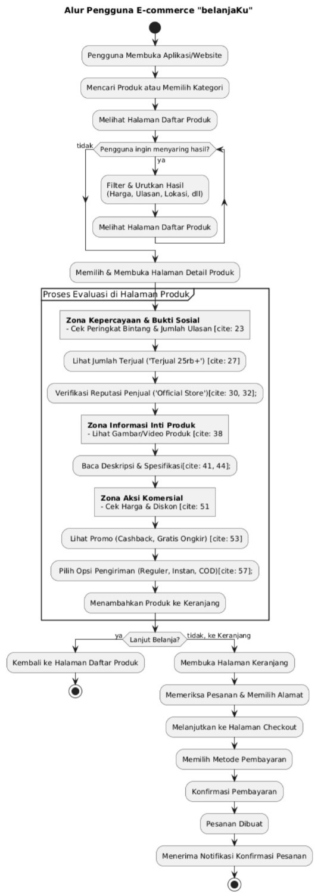
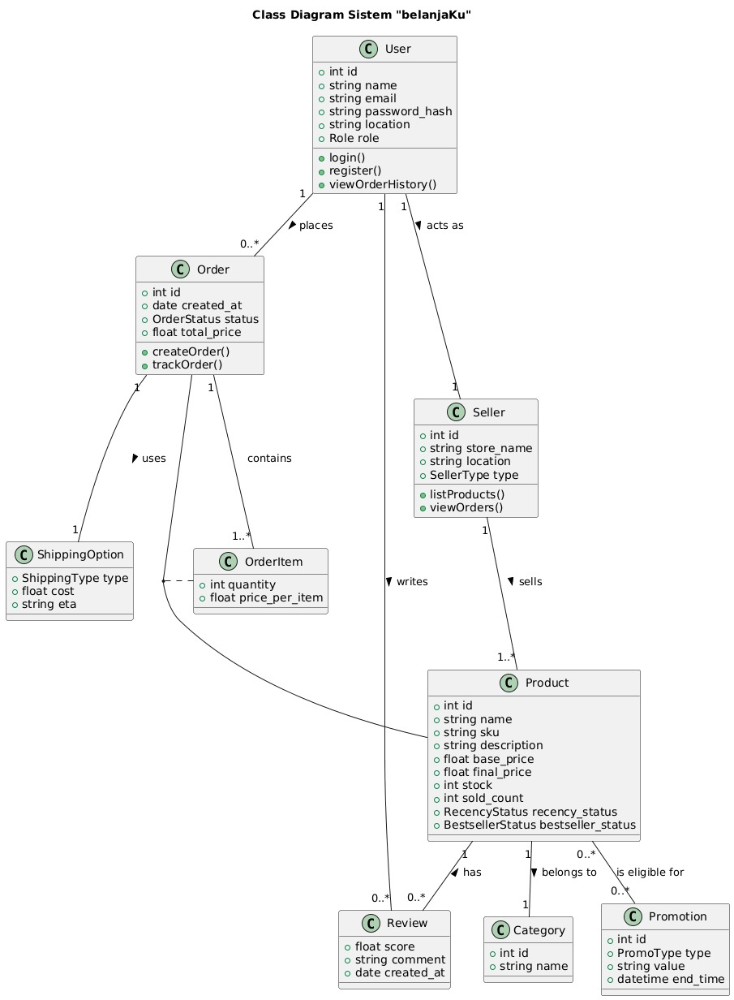

# Proyek E-commerce **belanjaKu**

Selamat datang di repositori proyek **belanjaKu**.  
Proyek ini merupakan implementasi cetak biru arsitektur untuk platform e-commerce modern yang dinamis dan berkonversi tinggi, dengan meniru strategi pemimpin pasar di Indonesia seperti **Tokopedia** dan **Shopee**.

---

## 📌 Ringkasan Eksekutif

**belanjaKu** dirancang lebih dari sekadar platform e-commerce biasa.  
Inti dari proyek ini adalah **arsitektur halaman produk dinamis** yang dibangun di atas kerangka kerja modular berbasis data. Sistem ini menggunakan **Master Prompt**, sebuah sistem variabel terstruktur yang mampu menghasilkan skenario halaman produk yang realistis dan sadar konteks.

🎯 **Tujuan**: Menciptakan fondasi kuat bagi **manajer produk, desainer UX/UI, dan pengembang** dalam membangun pengalaman e-commerce kelas dunia yang disesuaikan dengan pasar Indonesia.

---

## 🏗 Filosofi Arsitektur: Anatomi Halaman Produk Berkonversi Tinggi

Halaman produk bukanlah halaman statis, melainkan **ekosistem dinamis** yang terbagi dalam **empat zona strategis utama** untuk membimbing pengguna dari penemuan hingga konversi:

1. **Zona Kepercayaan & Bukti Sosial**  
   Menghadirkan sinyal validasi kualitas produk dan keandalan penjual, seperti rating, jumlah terjual, dan lencana penjual.

2. **Zona Informasi Inti Produk**  
   Menyajikan fitur, manfaat, dan spesifikasi melalui galeri gambar/video serta deskripsi detail.

3. **Zona Aksi Komersial**  
   Mendorong keputusan pembelian dengan menampilkan harga, promosi, dan logistik secara jelas serta persuasif.

4. **Zona Penemuan & Navigasi**  
   Memberikan rekomendasi produk relevan untuk mendorong *cross-selling* dan *upselling*.

---

## ✨ Fitur Utama

Platform **belanjaKu** dirancang untuk mendukung fitur komprehensif yang esensial dalam e-commerce modern.

### 🔹 Bukti Sosial & Kepercayaan Pengguna
- **Peringkat & Ulasan**: Agregat bintang + jumlah ulasan.  
- **Metrik Kecepatan Penjualan**: Indikator popularitas (misal: *Terjual 25rb+*).  
- **Identitas Penjual Terverifikasi**: Nama toko, lokasi, lencana (*Official Store*, *Power Merchant*).  

### 🔹 Informasi Produk yang Kaya
- **Hierarki Visual**: Galeri gambar/video berkualitas tinggi.  
- **Deskripsi Terstruktur**: Deskripsi visual seperti *mini landing page*.  
- **Atribut & Spesifikasi**: Daftar lengkap untuk mendukung keputusan & pencarian.  

### 🔹 Mesin Harga & Promosi Berlapis
- **Tampilan Harga Dinamis**: Harga coret + diskon.  
- **Promosi Multi-Lapis**: Diskon, cashback, voucher, *Kombo Hemat*, *Flash Sale*.  
- **Gratis Ongkir**: Penawaran pengiriman gratis sebagai pendorong utama.  

### 🔹 Logistik & Opsi Pengiriman Fleksibel
- **Pilihan Pengiriman**: Instan, *Same Day*, Reguler, Kargo, COD.  
- **Transparansi Biaya & Waktu**: Informasi jelas tentang ongkir & estimasi tiba.  

### 🔹 Keterlibatan & Personalisasi Pengguna
- **Lencana Status Produk**: *Terbaru*, *Paling Laris*.  
- **Notifikasi Penting**: *Ingatkan Saya* untuk *price drop alert*.  

---

## ⚙️ Tech Stack yang Direkomendasikan

### 🎨 Frontend
- **Framework**: [Next.js (React)](https://nextjs.org/) – mendukung SSR & SSG untuk SEO dan performa.  
- **Bahasa**: TypeScript – aman & terkelola dengan type safety.  
- **Styling**: Tailwind CSS – utility-first untuk desain cepat & konsisten.  
- **Manajemen State**: Zustand / React Context – state global yang sederhana.  

### 🔧 Backend
- **Framework**: Node.js dengan Express.js / NestJS.  
- **Bahasa**: TypeScript – konsisten dengan frontend.  
- **API**: REST API – standar komunikasi client-server.  
- **Autentikasi**: JWT (JSON Web Token) – stateless & aman.  

### 🗄 Database
- **Utama**: PostgreSQL – kuat, andal, cocok untuk data transaksional.  
- **Caching**: Redis – caching untuk produk populer & sesi pengguna.  

### ☁️ Infrastruktur & Deployment
- **Kontainerisasi**: Docker – konsistensi lintas lingkungan.  
- **Cloud Provider**: AWS atau GCP.  
- **Deployment Frontend**: Vercel – hosting Next.js dengan CI/CD bawaan.  

## Arsitektur & Model Data {#arsitektur-model-data}

### Diagram Alur Pengguna (Flowchart)



### Diagram Kelas (Class Diagram)



### Contoh Struktur Data API (Berdasarkan Master Prompt)

Respons API untuk halaman produk akan mengikuti struktur modular ini,
memastikan konsistensi antara backend dan frontend.

```api
{  
\"user_context\": {  
\"location\": \"Jakarta Barat\"  
},  
\"product\": {  
\"name\": \"Kemeja Flanel Pria Lengan Panjang\",  
\"category\": \"Fashion Pria \> Kemeja\",  
\"sku\": \"KFP-001-RED-L\"  
},  
\"seller\": {  
\"name\": \"Toko Resmi Flanelku\",  
\"location\": \"Jakarta Utara\",  
\"type\": \"Official Store\"  
},  
\"social_proof\": {  
\"rating\": { \"score\": 4.9, \"count\": 32150 },  
\"sales\": { \"sold\": 75000, \"status\": \"terlaris\" },  
\"recency\": { \"status\": null }  
},  
\"commercial\": {  
\"pricing\": { \"base\": 200000, \"discount_percentage\": 5, \"final\":
190000 },  
\"promotions\": \[  
{ \"type\": \"cashback\", \"value\": \"5%\" },  
{ \"type\": \"shipping\", \"value\": \"Gratis Ongkir Min. Belanja
Rp50rb\" }  
\]  
},  
\"logistics\": {  
\"options\": \[  
{ \"type\": \"Instan\", \"cost\": 25000, \"eta\": \"1-2 jam\" },  
{ \"type\": \"Reguler\", \"cost\": 9000, \"eta\": \"1-2 hari\" },  
{ \"type\": \"COD\", \"cost\": 12000, \"eta\": \"2-3 hari\" }  
\]  
}  
}
```

## Skenario Penggunaan Dinamis

Arsitektur ini memungkinkan simulasi berbagai skenario siklus hidup
produk secara dinamis.

#### 1. Skenario A: Peluncuran Produk Baru {#skenario-a-peluncuran-produk-baru}

- **Tujuan**: Mendorong adopsi awal untuk produk baru tanpa riwayat penjualan.

- **Strategi**: Memanfaatkan tumpukan promosi yang agresif.

- **Konfigurasi API**: rating.count = 0, sales.sold = 0, recency.status = \'terbaru\', promotions diisi dengan diskon peluncuran, voucher, dan gratis ongkir.

#### 2. Skenario B: Produk Terlaris (Best-Seller) {#skenario-b-produk-terlaris-best-seller}

- **Tujuan**: Menampilkan produk pemimpin pasar dengan bukti sosial yang luar biasa.

- **Strategi**: Menekankan pada rating tinggi dan volume penjualan, dengan promosi minimal.

- **Konfigurasi API**: rating.count \> 10000, sales.sold \> 50000, sales.status = \'terlaris\', promosi minimal (misal: diskon kecil).

#### 3. Skenario C: Urgensi Flash Sale {#skenario-c-urgensi-flash-sale}

- **Tujuan**: Menciptakan urgensi yang kuat melalui promosi berbatas waktu.

- **Strategi**: Menggabungkan diskon besar dengan kelangkaan stok dan penghitung waktu mundur.

- **Konfigurasi API**: promotions berisi type: \'flash_sale\' dengan end_time, dan ditambah data inventory.stock yang rendah.

## Pemanfaatan Strategis Lintas Tim

Arsitektur ini dirancang untuk menjadi **\"sumber kebenaran tunggal\"**
yang menyelaraskan tim Desain, Produk, dan Rekayasa.

- **Untuk Desain UX/UI**: Memungkinkan desainer mengisi mockup dengan data yang realistis dan melakukan *stress testing* pada komponen UI.

- **Untuk Manajemen Produk**: Menjadi alat untuk validasi hipotesis dan merancang pengujian A/B yang terkontrol.

- **Untuk Rekayasa (Engineering)**: Berfungsi sebagai spesifikasi yang jelas untuk definisi *endpoint* API dan memodelkan logika bisnis di server.

## Setup & Instalasi {#setup-instalasi}

*(Bagian ini akan berisi instruksi tentang cara menjalankan proyek
secara lokal, termasuk prasyarat, instalasi dependensi, dan perintah
untuk menjalankan server pengembangan.)*
```clone
\# Clone repositori ini  
git clone https://github.com/awanmh/BelanjaKu.git  
  
\# Masuk ke direktori proyek  
cd belanjaku  
  
\# Instal dependensi  
npm install  
  
\# Jalankan server pengembangan  
npm run dev
```

## Cara Berkontribusi

Kami menyambut kontribusi dari komunitas. Silakan lihat CONTRIBUTING.md
untuk panduan lebih lanjut tentang cara berkontribusi pada proyek ini.
